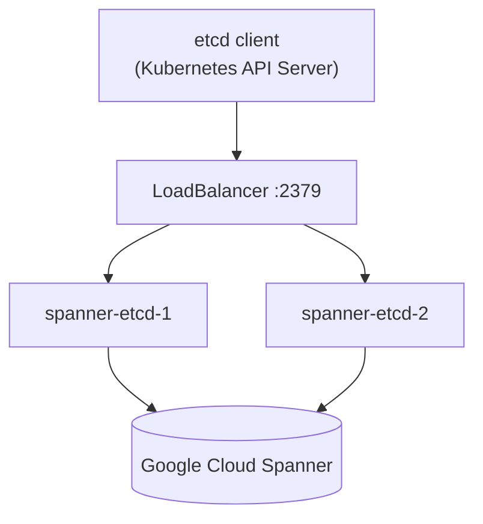
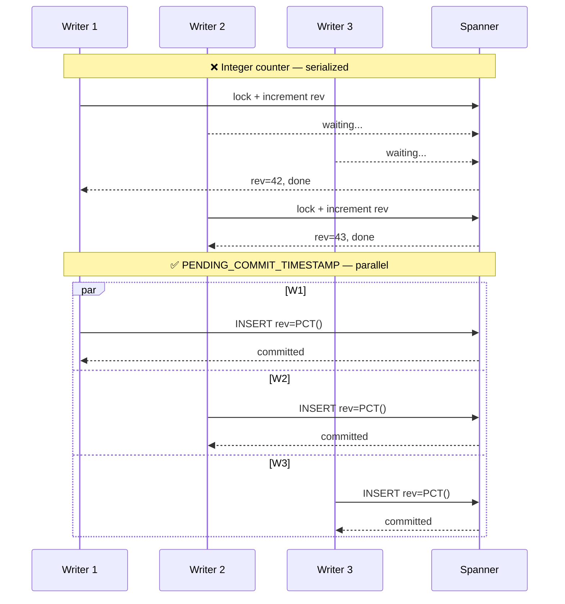

# Architecture

## Overview

```
Kubernetes API Server (or any etcd client)
         │  etcd v3 gRPC (optional TLS / mTLS)
         ▼
    spanner-etcd
    ┌───────────────────────────────────────┐
    │  KVServer     WatchServer             │
    │  LeaseServer  AuthServer              │
    │  ClusterServer  MaintenanceServer     │
    │           │                           │
    │      SpannerStore                     │
    │   ┌───────────────────────────────┐   │
    │   │  Write: INSERT kv             │   │
    │   │  rev = PENDING_COMMIT_TS()    │   │
    │   │  → no lock, no counter        │   │
    │   │                               │   │
    │   │  Watch: Change Stream reader  │   │
    │   │  (10–50ms) with poll fallback │   │
    │   │  (1s) for emulator            │   │
    │   │                               │   │
    │   │  Lease: TTL goroutine         │   │
    │   └───────────────────────────────┘   │
    └──────────────┬────────────────────────┘
                   │  Spanner gRPC
                   ▼
         Google Cloud Spanner
         ├── kv              (append-only KV log)
         ├── kv_rev          (compact revision only)
         ├── kv_lease        (TTL leases)
         ├── kv_cs_cursors   (Change Stream resume points)
         └── kv_changes      (Change Stream)
```

Multiple `spanner-etcd` replicas can run concurrently — all state lives in Spanner. No consensus, no leader election between replicas.



## Implemented etcd v3 API

| Service | Method | Status | Notes |
|---------|--------|--------|-------|
| **KV** | Range (Get/List) | ✅ | Single key, prefix, range, historical (rev=N), count-only |
| **KV** | Put | ✅ | Create + unconditional update |
| **KV** | DeleteRange | ✅ | Single key and prefix |
| **KV** | Txn | ✅ | Compare-and-swap: MOD, VERSION, CREATE, VALUE operators |
| **KV** | Compact | ✅ | Async GC of old revisions |
| **Watch** | Watch | ✅ | Live streaming, prefix filter, revision replay, PrevKv |
| **Lease** | LeaseGrant/Revoke | ✅ | TTL leases with immediate key deletion on revoke |
| **Lease** | LeaseKeepAlive | ✅ | Bidirectional streaming keepalive |
| **Lease** | LeaseTimeToLive | ✅ | TTL query |
| **Auth** | Authenticate | ✅ | Username/password → token; clients auto-re-authenticate on expiry |
| **Auth** | AuthEnable/Disable/Status | ✅ | Stubs — auth controlled via `--auth-users` flag |
| **Cluster** | MemberList | ✅ | Returns self as single member |
| **Maintenance** | Status | ✅ | Returns current revision |
| gRPC Health | Check | ✅ | Standard Kubernetes liveness probe |
| gRPC Health | `/healthz` HTTP | ✅ | Kubernetes readiness/liveness probe on metrics port |

## Spanner Schema

```sql
-- See ddl/schema.sql for the full DDL.

-- rev = PENDING_COMMIT_TIMESTAMP() on every write.
-- No shared counter row, no lock — each transaction is fully independent.
CREATE TABLE kv (
  id               INT64     NOT NULL DEFAULT (GET_NEXT_SEQUENCE_VALUE(SEQUENCE kv_seq)),
  rev              TIMESTAMP NOT NULL OPTIONS (allow_commit_timestamp = true),
  key              STRING(2048) NOT NULL,
  value            BYTES(MAX),
  old_value        BYTES(MAX),
  lease_id         INT64,
  deleted          BOOL NOT NULL DEFAULT (false),
  created          BOOL NOT NULL DEFAULT (false),
  create_revision  TIMESTAMP OPTIONS (allow_commit_timestamp = true),
  prev_revision    TIMESTAMP OPTIONS (allow_commit_timestamp = true)
) PRIMARY KEY (id);

-- kv_rev stores only the compact revision (not the current revision).
-- Current revision = SELECT rev FROM kv ORDER BY rev DESC LIMIT 1
CREATE TABLE kv_rev (
  id  INT64     NOT NULL,
  rev TIMESTAMP NOT NULL
) PRIMARY KEY (id);

-- Covering index: enables index-only reads for Get/List when the optimizer chooses it.
-- STORING value/old_value doubles write amplification — see docs/performance.md.
CREATE INDEX kv_key_rev ON kv (key, rev DESC)
  STORING (value, old_value, lease_id, deleted, created, create_revision, prev_revision);

-- Descending revision index for O(1) CurrentRevision() lookup.
CREATE INDEX kv_rev_desc ON kv (rev DESC);
```

## Design Decisions

**`PENDING_COMMIT_TIMESTAMP()` as revision**: Every write sets `rev = PENDING_COMMIT_TIMESTAMP()` — Spanner's TrueTime-based commit timestamp. No shared counter row, no lock. Each transaction is fully independent. etcd clients receive `rev` as `int64` (UnixNano), which is a valid etcd `ModRevision`. This eliminates the serialization bottleneck of integer counters and provides **15× higher write throughput** at ×32 concurrency.



**`id` vs `rev`**: Physical PK (`id`) uses `bit_reversed_positive` to distribute writes across Spanner splits and avoid hotspots.

**Append-only log**: Like etcd, rows in `kv` are never updated — each write appends a new row. Compaction physically deletes old rows asynchronously.

**Change Streams for Watch**: Each replica streams all partitions of `kv_changes`. Spanner pushes records as writes commit (~10–50ms). Partition cursors are persisted every 5s so replicas resume from the correct position after restart. The poll loop (1s) runs as a fallback when Change Streams are unavailable (Spanner emulator).

## Horizontal Scaling

All replicas are stateless — all state lives in Spanner.

```
                    LoadBalancer :2379
                   /              \
          spanner-etcd-1    spanner-etcd-2
                   \              /
                Google Cloud Spanner
```

On pod restart, Watch clients reconnect automatically via the etcd client retry logic. With `preStop: sleep 15s`, Kubernetes removes the pod from Service endpoints before SIGTERM — Watch streams migrate to surviving replicas with zero errors.

**Graceful shutdown sequence:**

```
t=0    preStop sleep (15s) — endpoint propagation
t=15s  SIGTERM → GracefulStop (10s timeout for in-flight RPCs)
t=25s  Force stop if needed; Spanner connections closed
t=60s  terminationGracePeriodSeconds — pod hard-killed by kubelet if still running
```

Tested: 45 Watch streams migrated to the surviving replica in ~10s, zero application errors.

## Known Limitations

### Auth tokens are per-replica

Auth tokens are stored in memory. A client that connected to replica-1 and switches to replica-2 receives `UNAUTHENTICATED` and re-authenticates automatically (tested with jetcd). No data is lost — only one extra round-trip on reconnect.

### Watch fan-out at extreme scale

With 10,000+ watchers and 1,000 writes/sec, the synchronous `dispatchEvents` becomes a goroutine scheduling bottleneck. Mitigation: add more replicas — each handles an independent subset of Watch connections.

### Change Streams not supported on Spanner emulator

The emulator does not support the `READ_kv_changes` TVF. spanner-etcd falls back to 1-second polling automatically. Watch latency on the emulator is ~1s; on production Spanner it is ~10–50ms.

### Txn with range ops is non-atomic

Txn operations containing `RangeEnd`, `CountOnly`, `IgnoreValue`, or `IgnoreLease` fall back to a non-atomic execution path (compare and execute as separate operations). Kubernetes core operations (leader election, object CRUD) always use the atomic path. Operators and tooling using range ops in Txn work correctly but without atomicity guarantees.

### Not implemented

- Auth RBAC (UserAdd/RoleAdd/GrantPermission) — not needed for standard Kubernetes
- Defrag / Snapshot — not needed (Spanner manages storage automatically)

## Why not kine?

[kine](https://github.com/k3s-io/kine) works well with PostgreSQL and MySQL but is a poor fit for Spanner: its `generic.Dialect` assumes `MAX(id)` equals the global revision (breaks with `bit_reversed_positive` sequences), relies on `LIKE ... ESCAPE` (unsupported), and uses reserved word aliases (`AS current`, `AS compact`). Almost every query needs overriding — at which point implementing `server.Backend` directly is cleaner.
