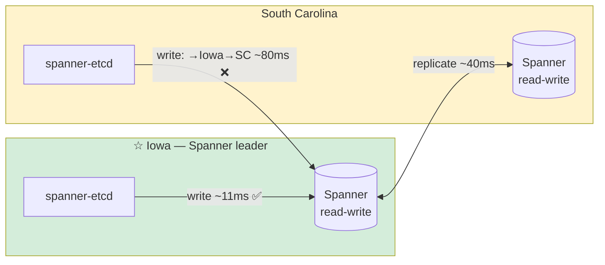

# Performance

All benchmarks run on GCP `e2-standard-4` (4 vCPU, 16GB, `us-central1-a`) against production Spanner in the same region — not the emulator.

## Write Throughput — PENDING_COMMIT_TIMESTAMP

Benchmarked with the old integer-counter baseline vs PENDING_COMMIT_TIMESTAMP:

| Clients | ops/sec | Avg latency |
|---------|---------|-------------|
| PUT ×1 | 86 | 11.7ms |
| PUT ×8 | 379 | 2.6ms |
| PUT ×32 | **673** | 1.5ms |

**vs. integer counter (same hardware):** ×1: 3.6× faster · ×8: 6.5× faster · ×32: **15× faster**

## Full Benchmark Suite — Production Spanner (us-central1, 1000 PU)

Benchmarked against a clean database. Results are averaged over 3 runs.
Covering index on `kv(key, rev DESC)` enables index-only reads when the optimizer chooses it.

| Operation | ops/sec | Avg latency | Notes |
|-----------|---------|-------------|-------|
| Create ×1 | **90** | 11.1ms | Single-key PUT |
| Create ×4 (parallel) | **270** | 3.7ms | PCT eliminates write serialization |
| Update ×1 | **88** | 11.4ms | CAS update |
| Get ×1 | **108** | 9.3ms | Single-key GET |
| Get ×4 (parallel) | **481** | 2.1ms | |
| List 100 keys | **40** | 25ms | Prefix scan, 100 results |
| Mixed ×4 (70% read / 20% write / 10% update) | **403** | 2.5ms | Kubernetes-like workload |
| Watch latency | — | **~30ms** | Change Stream end-to-end |

> Performance is dominated by Spanner round-trip latency (~10ms). For best results,
> run spanner-etcd in the same GCP region as your Spanner instance.

## Read Throughput (high concurrency)

| Clients | ops/sec | Avg latency |
|---------|---------|-------------|
| GET ×1 | 108 | 9.3ms |
| GET ×4 | 481 | 2.1ms |

## Spanner Processing Units — Scaling Comparison

Same VM (`us-central1-a`), clean database per run, same benchmark binary. Only Spanner PU changed.

| Operation | 100 PU | 1000 PU | 2000 PU |
|-----------|-------:|--------:|--------:|
| Create ×1 | 80 | 90 | 84 |
| Create ×4 parallel | **87** | **270** | **255** |
| Update ×1 | 65 | 88 | 84 |
| Get ×1 | 103 | 108 | 103 |
| Get ×4 parallel | 472 | 481 | 469 |
| List 100 keys | 50 | 40 | 40 |
| Mixed ×4 (70% read) | **294** | **403** | **404** |
| Watch latency | **29ms** | ~30ms | 30ms |

**Key observations:**

- **Single-key ops** are nearly identical across 1000 and 2000 PU — latency is dominated by network round-trip, not Spanner compute (Spanner CPU was at ~1% during benchmarks)
- **Parallel writes** drop significantly at 100 PU: Create ×4 falls from 270 to 87 ops/sec — the bottleneck shifts to Spanner under concurrent write load
- **Watch latency** is consistent at ~30ms across all tiers
- **100 PU is sufficient** for small Kubernetes clusters (< 100 nodes) with moderate write rates; upgrade to 1000 PU for larger clusters or sustained parallel workloads

## Multi-Region (nam6) vs Regional

`nam6` config: Iowa (×2 read-write) + South Carolina (×2 read-write) + Oregon + Los Angeles (read-only). Spanner leader resides in Iowa (`us-central1`).

Benchmarked from two VMs — one in Iowa (`us-central1-a`, same zone as leader), one in South Carolina (`us-east1-b`) — against the same `nam6` instance (1000 PU).

| Operation | Regional Iowa | nam6 from Iowa | nam6 from S.Carolina |
|-----------|-------------:|---------------:|---------------------:|
| Create ×1 | 90 | 53 | **11** |
| Create ×4 parallel | 270 | 203 | **45** |
| Update ×1 | 88 | 52 | **9** |
| Get ×1 | 108 | 116 | **12** |
| Get ×4 parallel | 481 | 577 | **52** |
| List 100 keys | 40 | 45 | **8** |
| Mixed ×4 (70% read) | 403 | 327 | **47** |
| Watch latency | ~30ms | **42ms** | 216ms |

> Note: South Carolina benchmarks were run on a database already populated by the Iowa run (~13K rows). Numbers are directionally correct but not on a clean baseline.

**Key observations:**

- **Writes from Iowa cost ~40% more on nam6** — every write must replicate synchronously to South Carolina before committing
- **South Carolina is 8× slower for writes** — Iowa→S.Carolina is ~1,500km; each write crosses that distance twice (to leader and back)
- **Reads from Iowa are faster on nam6** — strong reads served locally by the Iowa replica
- **Watch latency from Iowa on nam6 (42ms)** — slightly higher than regional due to Change Stream partition overhead across replicas
- **Rule of thumb:** deploy spanner-etcd replicas in the same region as the Spanner leader. Multi-region Spanner gives RPO=0 across a regional failure — you pay ~40% write latency from the leader region and ~8× from non-leader regions.

## Kubernetes v1.33 — 24h Soak Test

**Environment:** Kubernetes v1.33.12 (kubeadm, single-node), GCP `e2-standard-4`, production Spanner `regional` 1000 PU.

**Duration:** 24 hours continuous

**Load profile:**
- Rolling deployment scaled 1–10 replicas every 2 minutes
- ConfigMap churn every 3 minutes (create + bulk delete)
- cert-manager operator running concurrently
- 57 active Watch streams throughout

**Results:**

| Metric | Value |
|--------|-------|
| Critical errors (panic / unimplemented) | **0** |
| spanner-etcd uptime | **28h** (survived full test + data collection) |
| Change Stream active | **100%** of test duration |
| Active Watch streams | **57** stable |
| Total Txn operations | **185,952** |
| Total KV/Range operations | **237,312** |
| Auto-compaction | **140,924 rows** cleaned |
| Avg Txn latency | **~18.6ms** |
| Kubernetes node status | **Ready** throughout |

**Conclusion:** Zero crashes, zero data loss, zero unimplemented errors over 24 hours with a production Kubernetes v1.33 control plane.

## Kubernetes Workload — kubeadm v1.33.12

| Metric | Value |
|--------|-------|
| 50 Deployments created (parallel) | 3.75s |
| 100 pods Ready | 44s |
| KV/Range avg latency | ~18.6ms |

## Production Validation — GKE

Tested with **22 production Java/Kotlin microservices** (Vert.x + jetcd) on GKE:

- All services connected and loaded data from spanner-etcd on startup
- 45 active Watch streams across all services
- Auth token expiry (30s TTL) → auto-reauth with zero errors
- Pod kill → 45 Watch streams migrated to surviving replica in ~10s, zero errors
- Watch event delivery confirmed: jetcd received PUT events within ~1s (poll mode)
